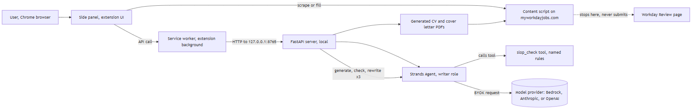

# jobie-agent

A Chrome extension plus a local [Strands Agents](https://strandsagents.com) agent. It takes you from a Workday job posting to a filled application form, with your own model key, and without the AI writing tells that recruiters now look for.

You open a posting on any `*.myworkdayjobs.com` site. The side panel reads it. The agent rewrites your CV for that role and writes the cover letter using facts from your CV only. A deterministic checker scans both drafts for named AI-writing patterns and sends them back until they come out clean. The extension then fills the Workday form pages and attaches the PDFs. It never presses Submit. You read every page and submit yourself.



## Quickstart

```
git clone https://github.com/kitfunso/jobie-agent.git
cd jobie-agent
python -m venv .venv
.venv\Scripts\pip install -r requirements.txt      (macOS or Linux: .venv/bin/pip)
copy .env.example .env                              (then put your key in .env)
scripts\run-server.cmd                              (or: python -m uvicorn server.app:app --host 127.0.0.1 --port 8765)
```

Then in Chrome: open `chrome://extensions`, turn on **Developer mode**, click **Load unpacked** and pick the `extension/` folder. Click the jobie-agent icon to open the side panel. On any Workday page a small jobie-agent pill also appears at the bottom right; click it to open the panel, or its x to hide it for that tab. The toolbar icon shows a WD badge on Workday tabs.

In the panel:

1. Click the **1 Set up once** row to open it. Pick a provider under **Settings** and click **Save**. Leave the key blank to use the one in `.env`.
2. Fill in **Profile**. Under **Notes for application questions** add the facts your CV does not hold: how you find jobs, right to work, notice period, employers you have worked for before. Click **Save**.
3. Upload your CV as a PDF under **CV**. It needs a text layer, so a scanned image will be rejected.
4. Open a Workday posting and click **Read this posting**. Edit the fields if the scrape got something wrong.
5. Click **Tailor CV and write letter**. This takes 30 to 90 seconds. Read the rounds, the letter, the CV, the changes and the gaps.
6. Click **Apply** on the posting yourself, choose **Apply Manually** and sign in. On the My Information page click **Run to review**. On each page it fills what the profile covers, applies answers you gave on earlier applications, then sends the fields still empty to the agent, which answers from your profile, notes, CV and those earlier answers and leaves blank what they do not say. Whatever is still required shows up in the panel under **Workday asks**: type each answer once, click **Save and continue**, and it is kept for the next application. If you would rather add the fact to your profile or notes, do that and click **Refresh**: the run reads the page again. The same box, with Refresh, stays up when a run stops on a field nobody could fill. It presses Save and Continue and stops on the Review page, on a Workday validation error, or on a page it does not recognise. Fix that page by hand and click Run to review again. **Fill this page** still fills one page without moving on.

Steps 1 to 3 are one-time. Profile and CV stay in the extension's storage, so the next application is steps 4 to 6. To carry them to another machine, click **Export data** under Your data in step 1: it saves `seed.json` with your profile, answers and CV, never the API key. Put that file in the `extension/` folder before you load the unpacked extension there and it starts with your data, or load it later with **Import a data file**. `seed.json` is git-ignored, so it never reaches GitHub by accident. Tailoring and the questions your profile cannot answer are the only steps that spend tokens, and Run to review runs the tailoring for you when there is no tailored output yet for the posting you read.

Each numbered stage collapses when you click its heading, and the panel remembers which ones you left open. Stage 1 folds to a one-line row once Settings, Profile and CV are all saved. The posting fields and the tailored output sit behind **Posting details** and **Letter and CV** so the two buttons you use most stay on screen.

## The anti-slop loop

Most "humanise my AI text" tools guess whether text sounds like a model and give you a score. jobie-agent does not guess. It has a list of named patterns, each with a regex and a fix, and it reports every match with the sentence it came from. Zero matches is the only pass.

The rule families in `agent/slop_rules.py`:

| Rule | What it catches |
|---|---|
| banned word | delve, leverage, robust, seamless, tapestry, testament, spearhead and about 35 more |
| cover letter cliche | "I am writing to express", "excited to apply", "proven track record", "team player", "perfect fit", "aligns with", "I look forward to", "Dear Hiring Manager", "thank you for considering" and about 30 more |
| empty phrase | filler that adds no fact |
| binary contrast | "not just X but Y" |
| throat clearing | openers that announce the sentence instead of saying it |
| faux insight | "the key is", "what matters is" |
| colon reveal | "The result: everything changed." (letters only) |
| superficial analysis | claims of depth with no specifics |
| importance puffery | "plays a vital role", "is essential to" |
| metadiscourse | text about the text |
| weasel attribution | "experts agree", "studies show" |
| negative listing | "no fluff, no filler, no nonsense" |
| dramatic fragmentation | one-word sentences for effect |
| rhetorical setup | "Why? Because" |
| hedging stack | "may potentially", "could possibly" |
| emoji | any |

On top of the regex rules, `agent/slop.py` checks the shape of the text: em dashes (one is enough to fail a letter), letters over 350 words, a closing paragraph that summarises, most sentences opening with "I", sentence lengths so even they read as machine output, a full-length letter with no contractions at all, more than two numbers in one sentence or more than six in the letter, a number or currency sign that appears in neither the CV nor the posting, and any run of eight words copied from the posting (the ad talking instead of the applicant) or from the example letter in the brief.

The checker runs in two layers:

1. **Inside the agent.** `slop_check` is a Strands `@tool`. The system prompt tells the model to call it on the letter before it answers, and to fix and re-check until it returns zero findings. The CV is checked once, outside.
2. **Outside the agent.** `agent/writer.py` runs the same `check()` on the letter and the CV the model returned. If anything remains, it sends the findings back as a rewrite prompt. Up to two rounds. This pass also has the CV text, so it is the one that catches a number the letter made up.

The server returns both layers as rounds, each `slop_check` call the model made mid-turn read back from the Strands message history plus the outside pass. The panel folds them into one line when the agent is done: how many self-checks it ran and whether the final pass was clean.

The model also gets a plain brief: facts from the CV only, list what the posting asks for that the CV does not show as a gap, 120 to 220 words for the letter, written as the applicant talking to one person with contractions where they would say them. One story told the way they would tell it in an interview, the earlier work in two or three sentences, then a close that admits the biggest gap and names the part of the role they would ask about first. One number per sentence, no clause telling the reader why a fact matters, no praise for the company, and a short example letter for tone that the echo check refuses to let it copy.

### A real run

`python -m scripts.smoke bedrock` from the repo root runs the loop once against `samples/cv.pdf` and `samples/posting.txt` (both git-ignored) and prints every check. One real CV, a senior data engineer posting, Claude Sonnet 4.6 on Bedrock:

```
model: global.anthropic.claude-sonnet-4-6
round 1 agent: 2 findings ['banned word', 'em dash']
round 1 agent: 3 findings ['banned word', 'banned word', 'em dash']
round 1 agent: 0 findings []
round 1 agent: 1 findings ['em dash']
round 1 agent: 0 findings []
round 1 loop: 0 findings []
```

The model called `slop_check` five times inside one turn, three of them with findings, and kept rewriting until the letter and the CV both came back clean. The outside check then found nothing, so the loop ended after one round. The letter opened on a shipped system and a number, stayed in the first person, and listed 11 posting requirements as gaps instead of claiming them.

The same run on Claude Haiku 4.5 also came back clean after six self-checks. Claude Sonnet 5 on Bedrock (`global.anthropic.claude-sonnet-5`) answered `AccessDeniedException: anthropic.claude-sonnet-5 is not available for this account` on the account used here, which is an account gate rather than the first-call subscription wait, so the Bedrock default stays on Sonnet 4.6. Sonnet 5 is the default on the Anthropic provider, where it needs only an API key. When a model call fails, the panel shows the provider's own message.

## Bring your own key

| Provider | Panel value | Env var fallback | Default model | Strands class |
|---|---|---|---|---|
| Amazon Bedrock | `bedrock` | `AWS_BEARER_TOKEN_BEDROCK`, or the usual boto3 credential chain | `global.anthropic.claude-sonnet-4-6` | `BedrockModel` |
| Anthropic | `anthropic` | `ANTHROPIC_API_KEY` | `claude-sonnet-5` | `AnthropicModel` |
| OpenAI | `openai` | `OPENAI_API_KEY` | `gpt-4o` | `OpenAIModel` |
| Nebius Token Factory | `nebius` | `NEBIUS_API_KEY` | `nvidia/nemotron-3-super-120b-a12b` | `OpenAIModel` with `base_url` `https://api.tokenfactory.nebius.com/v1/` |

A key typed in the panel wins over `.env`. The Bedrock region comes from the panel, then `AWS_REGION`, then `us-east-1`. The model id box in the panel overrides the default.

Bedrock enables a third-party model the first time you call it, but a Bedrock API key cannot accept the Marketplace agreement on its own: its IAM user has `AmazonBedrockLimitedAccess`, which lacks `bedrock:CreateFoundationModelAgreement`. If a model answers `AccessDeniedException`, attach `scripts/bedrock-enable-policy.json` to the key's IAM user as an inline policy, then run `python scripts/enable_model.py <model_id>` from the repo root. It accepts the offer, waits for the agreement, and makes one five-token call to prove it. The agreement costs nothing.

Keys travel from the panel to the local server on 127.0.0.1 and go straight into the Strands model object for that request. The server writes no keys to disk. The extension stores what you type in `chrome.storage.local`, which is plaintext on your own machine. See Limitations.

## It never presses Submit

The content script in `extension/content/workday.js` sets input values, picks dropdown options and attaches files. Run to review presses one button per page: the footer button whose text is exactly Save and Continue, Next or Continue. Workday keeps the same automation id on that button on the Review page, where it reads Submit, so the guard is the text: `advance()` refuses on the Review page and refuses any button whose text contains Submit, before it clicks anything. The panel loop also stops on a validation message, on a required field the agent could not answer, on a page it cannot name, after eight pages, or when the page does not change after the click. The tests in `tests/test_fake_page.py` drive this against a fake Workday page whose Review step has a Submit button under the real automation id, and assert it is never clicked.

## Application questions

Every tenant asks its own questions, so there is no list of them in the code. The content script reads each field on the page from Workday's own `formField-` wrappers: the label, the kind (text, dropdown, search box, radio, checkbox), the options of a dropdown or radio group, and whether the label carries the required star. The panel fills what the profile covers on its own and sends the rest to `POST /answer`. A second Strands agent answers from the profile, the notes and the CV, one structured answer per field with a reason, and returns null where those three say nothing: it will not guess whether you worked there before, how you heard of the job, or your right to work. Python then enforces the options, so a paraphrase of Yes never reaches a dropdown. The answers go back into the page through the same widget code the profile fill uses. Whatever is still empty and required is shown in the panel under Workday asks, with the page's own options where the field has any, and Save and Continue is not pressed until you answer it.

Every question a page asks, apart from the profile fields and the uploads, is recorded in an answer bank in the extension's storage, keyed by the question text. The bank holds the question, the options Workday offered, whether it was required, which company asked it, and your answer once you or the agent gave one. On the next application the bank is checked first: a saved answer is applied when it matches the question exactly and, for a dropdown or radio group, equals one of its options. The saved answers whose question shares a word with an open field are also sent along with the `/answer` request, so the model can reuse them when a tenant asks the same thing in other words. Values Workday remembered from an earlier draft are never stored. The bank is listed under Answers in step 1, with the required questions still waiting first, and every row can be edited there. Over time it becomes the full list of what employers ask you, answered once.

## Built with Strands Agents

- `strands.Agent` with a system prompt and one tool, built once per request with the user's model.
- A second `strands.Agent` for form answers, with structured output only: `FormAnswers`, one answer and one reason per field.
- `@tool slop_check` from `agent/writer.py`, so the model can check its own draft mid-turn.
- Structured output: each call passes `structured_output_model=TailorResult`, a Pydantic model with the CV markdown, the letter, the changes and the gaps. Tools and structured output work in the same invocation.
- Four model providers from `strands.models`: `BedrockModel` with a Bedrock API key as bearer token, `AnthropicModel`, `OpenAIModel`, and `OpenAIModel` pointed at Nebius Token Factory for NVIDIA Nemotron, picked per request from the panel.

The Python side is FastAPI on `127.0.0.1:8765` with five endpoints: `GET /health`, `POST /cv/parse`, `POST /tailor`, `POST /answer` and `GET /files/{name}`. PDFs are rendered with reportlab from a small markdown subset. CV text comes out of the PDF with pypdf.

## Limitations

- Workday selectors have been verified on one real tenant (edftrading.wd1) for the posting page, the progress bar that names each apply step, and every widget on the My Information page (text, dropdown, search box, radio, checkbox), plus the bundled fake page in `extension/test/fake-workday.html`. The My Experience upload and cover letter selectors come from open-source fillers and are not yet checked on a live tenant. Real Workday tenants vary. Fields the script cannot find are listed under Skipped after a fill and you type them by hand.
- No account creation and no sign-in. Workday's apply flow needs an account on each employer's tenant, and that step stays manual on purpose.
- The API key and profile live in `chrome.storage.local` as plaintext. Anyone with access to your Chrome profile can read them. Use a key you can revoke.
- The CV PDF needs a text layer. Scans and image-only PDFs are rejected with a clear error.
- The checker is deterministic, so it catches only what it has a rule for. It will not catch a made-up fact. Read the letter before you send it. The gaps list is there to help.
- Free-text answers to application questions skip the checker. Read them on the page before you press Save and Continue.
- One posting at a time. There is no queue and no history.
- Run to review's footer button was verified on edftrading.wd1; the error selectors come from open-source fillers. If Workday's button has a different id, the text fallback finds it by its label. Voluntary disclosures and self-identification pages get the same treatment as any other: the agent answers only what your notes state, and the panel lists the rest for you.

## Tests

```
.venv\Scripts\python.exe -m pytest tests -q
```

The suite covers the checker rules, PDF round trips, the writer loop with a fake model, the provider builder, the server with the agent mocked, and the content scripts driven through installed Chrome with Playwright.

## License

MIT. See `LICENSE`.
