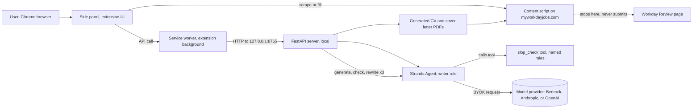

Architecture of jobie-agent. Source for docs/architecture.png.

```mermaid
flowchart LR
  U[User, Chrome browser] --> SP[Side panel, extension UI]
  SP -->|scrape or fill| CS[Content script on myworkdayjobs.com]
  SP -->|API call| SW[Service worker, extension background]
  SW -->|HTTP to 127.0.0.1:8765| API[FastAPI server, local]
  API --> W[Strands Agent, writer role]
  W -->|calls tool| SC[slop_check tool, named rules]
  API -->|generate, check, rewrite x3| W
  W -->|BYOK request| M[(Model provider: Bedrock, Anthropic, or OpenAI)]
  API --> PDF[Generated CV and cover letter PDFs]
  PDF --> CS
  CS -.->|stops here, never submits| R[Workday Review page]
```
