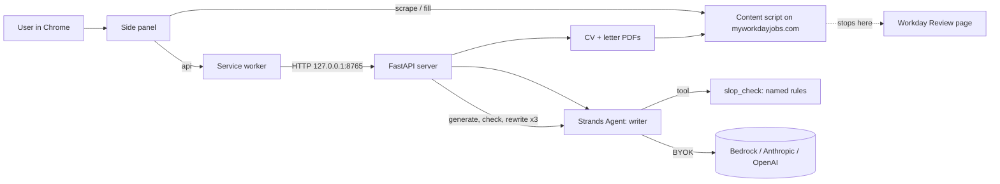

# jobie-agent Implementation Plan

> **For Claude:** REQUIRED SUB-SKILL: Use executing-plans to implement this plan task-by-task.

**Goal:** A Chrome extension plus a local Strands agent that reads a Workday job posting, tailors the applicant's CV, writes a cover letter that passes a deterministic anti-AI-slop check, fills the Workday application, and stops one click before Submit.

**Architecture:** Two processes. A Python FastAPI server on `127.0.0.1:8765` hosts a Strands `Agent` whose tools include a deterministic slop scorer; the server drives a generate, check, rewrite loop (max 3 rounds) and renders the tailored CV and letter to PDF. A Manifest V3 extension (side panel UI, service worker as the only HTTP client, content script on `*.myworkdayjobs.com`) scrapes the posting, sends it with the CV text and the user's own API key to the server, then fills the Workday form with the results. Nothing leaves the laptop except calls to the model provider the user chose.

**Tech Stack:** Python 3.12, strands-agents 1.55.1 (`[anthropic,openai]` extras), FastAPI, uvicorn, pydantic 2, pypdf 6, reportlab, pytest. Extension: plain JS, no bundler.

---

## Time budget (BST, Sep 14)

| Stage | Done by | Gate |
|---|---|---|
| Plan reviewed, deps installed | 13:15 | `python -m pytest` runs (0 tests ok) |
| Tasks 1 to 5 (Python core) | 15:30 | `pytest` green, `/tailor` returns a letter with 0 findings on a real posting |
| Tasks 6 to 8 (extension) | 18:00 | Fake Workday page fills end to end |
| Task 9 (real Workday run, user drives) | 19:30 | Real application reaches the Review page |
| Task 10 (README, diagram, Devpost text) | 21:30 | Repo pushed, README renders |
| Code freeze | 22:00 | Tag `v0.1.0` |
| Video + Devpost form (user) | 00:30 Sep 15 | Submitted (deadline 01:00) |

Stretch, only if Task 9 passes before 19:00: Greenhouse and Lever via the generic filler (Task 8).

## Repo layout

```
jobie-agent/
  agent/            Python package: slop rules, scorer, writer loop, providers, cv, pdf
  server/           FastAPI app
  extension/        Chrome MV3 extension (load unpacked)
  tests/            pytest
  docs/             plans, architecture diagram, demo script
  samples/          git-ignored: real CV, saved postings
  requirements.txt  runtime deps
  requirements-dev.txt
  .env.example      key template (already committed)
```

## Locked contracts (Python and JS agents build against these in parallel)

`POST /tailor` request:

```json
{
  "posting": {"title": "", "company": "", "location": "", "description": "", "url": ""},
  "cv_text": "",
  "provider": {"name": "bedrock|anthropic|openai", "api_key": "", "model_id": "", "region": ""}
}
```

Empty `api_key`, `model_id` or `region` means "use the server's `.env` and provider default".

`POST /tailor` response:

```json
{
  "cv_markdown": "", "cover_letter": "", "changes": [""], "gaps": [""],
  "rounds": [{"round": 1, "findings": [{"rule": "", "quote": "", "fix": ""}]}],
  "cv_pdf": "/files/<id>-cv.pdf", "letter_pdf": "/files/<id>-letter.pdf"
}
```

`POST /cv/parse` multipart `file` → `{"text": ""}`. `GET /files/{name}` → PDF bytes. `GET /health` → `{"ok": true, "version": "0.1.0"}`.

Extension messages (all `chrome.runtime.sendMessage` / `chrome.tabs.sendMessage`, JSON):

| From → to | Message | Reply |
|---|---|---|
| side panel → service worker | `{type:"api", method, path, body}` | `{ok, status, data}` |
| side panel → service worker | `{type:"fetch_pdf", path}` | `{ok, name, b64}` |
| side panel → content script | `{type:"scrape"}` | `{ok, posting}` |
| side panel → content script | `{type:"fill", data}` | `{ok, filled:[], skipped:[]}` |

`fill.data` = `{profile:{first_name,last_name,email,phone,country,city,linkedin}, cover_letter, files:[{name,b64}]}`.

---

### Task 0: Dependencies and skeleton

**Files:**
- Create: `requirements.txt`, `requirements-dev.txt`, `pytest.ini`, `agent/__init__.py`, `server/__init__.py`, `tests/__init__.py`

**Step 1: Write the files**

`requirements.txt`:
```
strands-agents[anthropic,openai]>=1.55,<2
strands-agents-tools>=0.8
fastapi>=0.115
uvicorn>=0.30
pydantic>=2
pypdf>=6
reportlab>=4
python-dotenv>=1
python-multipart>=0.0.9
```

`requirements-dev.txt`:
```
-r requirements.txt
pytest>=8
httpx>=0.27
```

`pytest.ini`:
```
[pytest]
testpaths = tests
```

The three `__init__.py` files are empty.

**Step 2: Install**

Run: `C:\Users\kit.sofun\dev\jobie-agent\.venv\Scripts\python.exe -m pip install -r C:\Users\kit.sofun\dev\jobie-agent\requirements-dev.txt`
Expected: ends with `Successfully installed ...` including fastapi, reportlab, pytest, anthropic, openai.

**Step 3: Verify**

Run: `C:\Users\kit.sofun\dev\jobie-agent\.venv\Scripts\python.exe -m pytest -q`
Expected: `no tests ran` and exit code 5 (fine).

**Step 4: Commit**

```
git -C C:\Users\kit.sofun\dev\jobie-agent add requirements.txt requirements-dev.txt pytest.ini agent/__init__.py server/__init__.py tests/__init__.py
git -C C:\Users\kit.sofun\dev\jobie-agent commit -F <msgfile>   # "chore: python deps and package skeleton"
```

---

### Task 1: Slop rules and scorer

The scorer is the product's core claim. It is deterministic: a list of named rules from the @no-ai-slop skill, each with a regex and a fix. Zero findings means the text passes. It never guesses "AI or not"; it names patterns a human can check.

**Files:**
- Create: `agent/slop_rules.py`, `agent/slop.py`
- Test: `tests/test_slop.py`

**Step 1: Write the failing tests**

```python
# tests/test_slop.py
from agent.slop import check

CLEAN_LETTER = (
    "Dear Ms Patel,\n\nYour posting asks for someone who has cut settlement errors on a live "
    "trading desk. At Unipec I rebuilt the freight reconciliation job and errors fell from 40 a "
    "month to 3.\n\nThe role also needs Python and SQL in production. I run both daily against a "
    "20 TB lake and I wrote the sync script the desk still uses.\n\nI would like to talk about "
    "the crude desk work in the second paragraph of the posting. I am free any afternoon next week.\n\n"
    "Keith So"
)


def test_clean_letter_has_no_findings():
    assert check(CLEAN_LETTER, "letter") == ()


def test_banned_word_is_named_and_quoted():
    text = "I leverage a robust toolkit to delve into data."
    names = {f.rule for f in check(text, "letter")}
    assert "banned word" in names
    quotes = [f.quote for f in check(text, "letter")]
    assert any("leverage" in q for q in quotes)


def test_cover_letter_cliche():
    text = "I am writing to express my interest in the role. I have a proven track record."
    names = {f.rule for f in check(text, "letter")}
    assert "cover letter cliche" in names


def test_binary_contrast():
    text = "This is not just a job for me, but a calling."
    assert any(f.rule == "binary contrast" for f in check(text, "letter"))


def test_em_dash_flagged_in_letter_only():
    text = "I built the pipeline — it runs nightly."
    assert any(f.rule == "em dash" for f in check(text, "letter"))
    assert not any(f.rule == "em dash" for f in check(text, "cv"))


def test_summary_ending():
    text = "First point here.\n\nSecond point here.\n\nIn conclusion, I would be a great fit."
    assert any(f.rule == "summary ending" for f in check(text, "letter"))


def test_monotone_openers():
    text = "I did this. I did that. I did more. I did it again. I did it once more. I rest."
    assert any(f.rule == "monotone openers" for f in check(text, "letter"))


def test_too_long_letter():
    text = "word " * 400
    assert any(f.rule == "too long" for f in check(text, "letter"))


def test_colon_reveal_is_letter_only():
    text = "The best part: it learns."
    assert any(f.rule == "colon reveal" for f in check(text, "letter"))
    assert not any(f.rule == "colon reveal" for f in check(text, "cv"))
```

**Step 2: Run tests to verify they fail**

Run: `.venv\Scripts\python.exe -m pytest tests/test_slop.py -q`
Expected: `ModuleNotFoundError: No module named 'agent.slop'`

**Step 3: Write the rules**

```python
# agent/slop_rules.py
"""Named AI-writing patterns. Source: the no-ai-slop skill rule list plus cover-letter cliches."""
from __future__ import annotations

import re
from dataclasses import dataclass

LETTER = ("letter",)
BOTH = ("letter", "cv")


@dataclass(frozen=True)
class Rule:
    name: str
    pattern: re.Pattern[str]
    fix: str
    kinds: tuple[str, ...] = BOTH


def _any(*alts: str) -> re.Pattern[str]:
    return re.compile(r"\b(?:" + "|".join(alts) + r")\b", re.IGNORECASE)


BANNED_WORDS = _any(
    r"delv(?:e|es|ed|ing)", r"foster(?:s|ed|ing)?", r"leverag(?:e|es|ed|ing)",
    r"utili[sz](?:e|es|ed|ing)", r"facilitat(?:e|es|ed|ing)", r"empower(?:s|ed|ing)?",
    r"streamlin(?:e|es|ed|ing)", r"robust", r"cutting-edge", r"paradigm shift",
    r"game[- ]chang(?:er|ing)", r"this is huge", r"this changes everything", r"tapestry",
    r"realm", r"beacon", r"multifaceted", r"meticulous(?:ly)?", r"intricate", r"paramount",
    r"transformative", r"elevat(?:e|es|ed|ing)", r"embark(?:s|ed|ing)?", r"supercharg(?:e|es|ed|ing)",
    r"harness(?:es|ed|ing)?", r"ever-evolving", r"seamless(?:ly)?", r"holistic", r"crucial",
    r"pivotal", r"unlock(?:s|ed|ing)?", r"nuanced", r"vibrant", r"showcas(?:e|es|ed|ing)",
    r"boast(?:s|ed|ing)?", r"notably", r"surpass(?:es|ed|ing)?", r"garner(?:s|ed|ing)?",
    r"strategically", r"testament", r"underscor(?:es|ed|ing)", r"synerg(?:y|ies|istic)",
    r"spearhead(?:s|ed|ing)?",
)

CLICHES = _any(
    r"i am writing to (?:express|apply)", r"excited to apply", r"thrilled", r"passionate about",
    r"proven track record", r"results[- ]driven", r"team player", r"hit the ground running",
    r"fast-paced environment", r"self-starter", r"go-getter", r"detail-oriented",
    r"think(?:ing)? outside the box", r"perfect fit", r"ideal candidate", r"wealth of experience",
    r"i believe (?:i|my)", r"dynamic (?:team|environment|role)",
)

EMPTY_PHRASES = _any(
    r"it'?s worth noting", r"it'?s important to note", r"at the end of the day", r"when it comes to",
    r"at its core", r"in today'?s world", r"in the age of", r"in the world of", r"the reality is",
    r"the truth is", r"in terms of", r"with regard to", r"in order to", r"going forward",
    r"let'?s dive in",
)

RULES: tuple[Rule, ...] = (
    Rule("banned word", BANNED_WORDS, "replace with the plain word or the concrete fact"),
    Rule("cover letter cliche", CLICHES, "state the specific result or role fact instead", LETTER),
    Rule("empty phrase", EMPTY_PHRASES, "cut the phrase, keep the point"),
    Rule("binary contrast", re.compile(
        r"\bnot (?:just|only|merely)\b[^.\n]{1,80}\bbut\b|\b(?:isn'?t|is not|wasn'?t) (?:just |only )?[^.\n]{1,60}[.;]\s*(?:it'?s|it is)\b",
        re.IGNORECASE), "state the second half directly", LETTER),
    Rule("throat clearing", re.compile(
        r"(?:^|(?<=[.!?]\s))(?:here'?s the thing|here'?s what i mean|let me be clear|i'?ll be honest|the uncomfortable truth is)",
        re.IGNORECASE | re.MULTILINE), "delete the opener", LETTER),
    Rule("faux insight", re.compile(
        r"what most people (?:get wrong|miss)|here'?s what nobody tells you|the part everyone misses|this is the part most people skip",
        re.IGNORECASE), "cut the setup, make the claim stand alone"),
    Rule("colon reveal", re.compile(r"(?m)^[^:\n]{3,40}: [a-z][^\n.]{3,80}\.$"),
         "rewrite as a plain sentence", LETTER),
    Rule("superficial analysis", re.compile(
        r",\s*(?:highlighting|underscoring|reflecting|showcasing|demonstrating|signal(?:l)?ing|emphasi[sz]ing)\b",
        re.IGNORECASE), "replace the -ing clause with the concrete consequence"),
    Rule("importance puffery", re.compile(
        r"stands as a testament|testament to|pivotal moment|plays a vital role|solidif(?:y|ies) (?:its|my) position|underscores (?:its|the) significance",
        re.IGNORECASE), "state the fact and let the reader judge"),
    Rule("metadiscourse", re.compile(
        r"that last part matters|the key point is|as you can see|this distinction matters|in other words",
        re.IGNORECASE), "delete the aside"),
    Rule("weasel attribution", re.compile(
        r"experts agree|industry reports suggest|many argue|widely regarded as|studies show",
        re.IGNORECASE), "name the source or cut the claim"),
    Rule("negative listing", re.compile(r"(?:^|\.\s)Not an? \w+\. Not an? \w+\.", re.MULTILINE),
         "say what it is", LETTER),
    Rule("dramatic fragmentation", re.compile(r"That'?s it\. That'?s the whole thing\.|\. And \w+\. And \w+\.",
         re.IGNORECASE), "use complete sentences", LETTER),
    Rule("rhetorical setup", re.compile(r"what if i told you|think about it:|plot twist:", re.IGNORECASE),
         "drop the setup and make the point", LETTER),
    Rule("hedging stack", re.compile(r"\b(?:arguably|generally speaking|it could be said)\b", re.IGNORECASE),
         "commit to the claim or cut it"),
    Rule("emoji", re.compile(r"[\U0001F300-\U0001FAFF\u2600-\u27BF]"), "remove"),
)

SUMMARY_OPENERS = re.compile(r"^\s*(?:in conclusion|ultimately|overall|in summary|to sum up|to summari[sz]e)\b", re.IGNORECASE)
EM_DASH = re.compile(r"—|–| -- ")
SENTENCE_SPLIT = re.compile(r"(?<=[.!?])\s+")
MAX_LETTER_WORDS = 350
```

**Step 4: Write the scorer**

```python
# agent/slop.py
"""Deterministic scorer: returns named findings, never an AI-or-not guess."""
from __future__ import annotations

import statistics
from dataclasses import dataclass

from agent.slop_rules import (EM_DASH, MAX_LETTER_WORDS, RULES, SENTENCE_SPLIT, SUMMARY_OPENERS)


@dataclass(frozen=True)
class Finding:
    rule: str
    quote: str
    fix: str


def check(text: str, kind: str = "letter") -> tuple[Finding, ...]:
    findings: list[Finding] = []
    for rule in RULES:
        if kind not in rule.kinds:
            continue
        for match in rule.pattern.finditer(text):
            findings.append(Finding(rule.name, _sentence_around(text, match.start()), rule.fix))
    findings.extend(_shape_findings(text, kind))
    return tuple(findings)


def _sentence_around(text: str, pos: int) -> str:
    start = max(text.rfind(".", 0, pos), text.rfind("\n", 0, pos)) + 1
    end_candidates = [i for i in (text.find(".", pos), text.find("\n", pos)) if i != -1]
    end = min(end_candidates) + 1 if end_candidates else len(text)
    return text[start:end].strip()[:160]


def _sentences(text: str) -> list[str]:
    return [s.strip() for s in SENTENCE_SPLIT.split(text) if s.strip()]


def _shape_findings(text: str, kind: str) -> list[Finding]:
    out: list[Finding] = []
    sentences = _sentences(text)
    dashes = len(EM_DASH.findall(text))
    if (kind == "letter" and dashes >= 1) or dashes >= 3:
        out.append(Finding("em dash", _sentence_around(text, EM_DASH.search(text).start()), "use a comma, full stop or brackets"))
    if kind != "letter":
        return out
    words = len(text.split())
    if words > MAX_LETTER_WORDS:
        out.append(Finding("too long", f"{words} words", f"cut to under {MAX_LETTER_WORDS} words"))
    paragraphs = [p for p in text.split("\n\n") if p.strip()]
    if paragraphs and SUMMARY_OPENERS.match(paragraphs[-1]):
        out.append(Finding("summary ending", paragraphs[-1][:160], "end on the last concrete point or next action"))
    if len(sentences) >= 5:
        i_openers = sum(1 for s in sentences if s.startswith("I "))
        if i_openers / len(sentences) >= 0.6:
            out.append(Finding("monotone openers", " ".join(sentences[:2])[:160], "start fewer sentences with I"))
    if len(sentences) >= 6:
        lengths = [len(s.split()) for s in sentences]
        if statistics.pstdev(lengths) < 3.0:
            out.append(Finding("robotic rhythm", " ".join(sentences[:2])[:160], "vary sentence length"))
    return out
```

**Step 5: Run tests to verify they pass**

Run: `.venv\Scripts\python.exe -m pytest tests/test_slop.py -q`
Expected: `9 passed`. If `test_clean_letter_has_no_findings` fails, print the findings and fix the rule that misfired, not the fixture, unless the fixture really contains a pattern.

**Step 6: Commit**

`feat: deterministic anti-slop scorer with named rules`

---

### Task 2: CV text extraction and PDF rendering

**Files:**
- Create: `agent/cv.py`, `agent/pdf.py`
- Test: `tests/test_cv.py`, `tests/test_pdf.py`

**Step 1: Write the failing tests**

```python
# tests/test_cv.py
from pathlib import Path
import pytest
from agent.cv import extract_text

SAMPLE = Path("samples/cv.pdf")


@pytest.mark.skipif(not SAMPLE.exists(), reason="local CV sample only")
def test_extracts_real_cv_text():
    text = extract_text(SAMPLE.read_bytes())
    assert len(text) > 500
    assert "\n" in text


def test_empty_pdf_raises():
    with pytest.raises(ValueError):
        extract_text(b"%PDF-1.4 not really")
```

```python
# tests/test_pdf.py
from io import BytesIO
from pypdf import PdfReader
from agent.pdf import render_markdown_pdf

MD = "# Keith So\n\nLondon, kit@example.com\n\n## Experience\n\n- **Unipec** 2021 to now: cut errors 40 to 3\n- Second bullet\n"


def test_renders_headings_and_bullets(tmp_path):
    out = render_markdown_pdf(MD, tmp_path / "cv.pdf")
    assert out.stat().st_size > 1000
    text = PdfReader(BytesIO(out.read_bytes())).pages[0].extract_text()
    assert "Keith So" in text and "Experience" in text and "Second bullet" in text
```

**Step 2: Run to verify they fail**

Run: `.venv\Scripts\python.exe -m pytest tests/test_cv.py tests/test_pdf.py -q`
Expected: `ModuleNotFoundError`

**Step 3: Implement**

```python
# agent/cv.py
from __future__ import annotations

from io import BytesIO

from pypdf import PdfReader
from pypdf.errors import PdfReadError


def extract_text(pdf_bytes: bytes) -> str:
    try:
        reader = PdfReader(BytesIO(pdf_bytes))
        pages = [page.extract_text() or "" for page in reader.pages]
    except PdfReadError as exc:
        raise ValueError(f"not a readable PDF: {exc}") from exc
    text = "\n\n".join(p.strip() for p in pages if p.strip())
    if len(text) < 50:
        raise ValueError("no text layer found; export the CV as a text PDF, not a scan")
    return text
```

```python
# agent/pdf.py
"""Tiny markdown subset (#, ##, -, **bold**) to PDF. Enough for a CV and a letter."""
from __future__ import annotations

import re
from pathlib import Path
from xml.sax.saxutils import escape

from reportlab.lib.pagesizes import A4
from reportlab.lib.styles import ParagraphStyle, getSampleStyleSheet
from reportlab.lib.units import mm
from reportlab.platypus import ListFlowable, ListItem, Paragraph, SimpleDocTemplate, Spacer

BOLD = re.compile(r"\*\*(.+?)\*\*")


def _inline(text: str) -> str:
    return BOLD.sub(r"<b>\1</b>", escape(text))


def render_markdown_pdf(markdown: str, path: Path) -> Path:
    styles = getSampleStyleSheet()
    body = ParagraphStyle("body", parent=styles["BodyText"], fontSize=10.5, leading=14)
    flow: list = []
    bullets: list[str] = []

    def flush_bullets() -> None:
        if bullets:
            flow.append(ListFlowable([ListItem(Paragraph(_inline(b), body)) for b in bullets], bulletType="bullet", leftIndent=12))
            bullets.clear()

    for line in markdown.splitlines():
        stripped = line.strip()
        if stripped.startswith("- "):
            bullets.append(stripped[2:])
            continue
        flush_bullets()
        if stripped.startswith("# "):
            flow.append(Paragraph(_inline(stripped[2:]), styles["Title"]))
        elif stripped.startswith("## "):
            flow.append(Spacer(1, 4 * mm))
            flow.append(Paragraph(_inline(stripped[3:]), styles["Heading2"]))
        elif stripped:
            flow.append(Paragraph(_inline(stripped), body))
        else:
            flow.append(Spacer(1, 2 * mm))
    flush_bullets()
    path.parent.mkdir(parents=True, exist_ok=True)
    SimpleDocTemplate(str(path), pagesize=A4, leftMargin=18 * mm, rightMargin=18 * mm, topMargin=16 * mm, bottomMargin=16 * mm).build(flow)
    return path
```

**Step 4: Run tests**

Run: `.venv\Scripts\python.exe -m pytest tests/test_cv.py tests/test_pdf.py -q`
Expected: `3 passed` (2 if the CV sample is absent, 1 skipped).

**Step 5: Commit**

`feat: CV text extraction and markdown to PDF rendering`

---

### Task 3: Provider factory (bring your own key)

Verified against the installed SDK: `AnthropicModel(client_args={"api_key": ...}, model_id=..., max_tokens=...)` where `max_tokens` is required; `OpenAIModel(client_args={"api_key": ...}, model_id=...)`; `BedrockModel(model_id=..., region_name=..., api_key=...)` where `api_key` sets the bearer header. Bedrock default model id in the SDK is `global.anthropic.claude-sonnet-4-6`, default region is `AWS_REGION` or `us-west-2`.

**Files:**
- Create: `agent/providers.py`
- Test: `tests/test_providers.py`

**Step 1: Write the failing tests**

```python
# tests/test_providers.py
import pytest
from agent.providers import ProviderConfig, build_model


def test_anthropic_uses_given_key_and_default_model():
    model = build_model(ProviderConfig(name="anthropic", api_key="sk-test"))
    assert type(model).__name__ == "AnthropicModel"
    assert model.get_config()["model_id"] == "claude-sonnet-5"


def test_openai_model_id_override():
    model = build_model(ProviderConfig(name="openai", api_key="sk-test", model_id="gpt-4o-mini"))
    assert model.get_config()["model_id"] == "gpt-4o-mini"


def test_bedrock_reads_env_when_key_empty(monkeypatch):
    monkeypatch.setenv("AWS_BEARER_TOKEN_BEDROCK", "bearer-test")
    monkeypatch.setenv("AWS_REGION", "us-east-1")
    model = build_model(ProviderConfig(name="bedrock"))
    assert type(model).__name__ == "BedrockModel"
    assert model.get_config()["model_id"] == "global.anthropic.claude-sonnet-4-6"


def test_unknown_provider_raises():
    with pytest.raises(ValueError):
        build_model(ProviderConfig(name="llama-on-a-toaster", api_key="x"))


def test_missing_key_raises(monkeypatch):
    monkeypatch.delenv("ANTHROPIC_API_KEY", raising=False)
    with pytest.raises(ValueError):
        build_model(ProviderConfig(name="anthropic"))
```

**Step 2: Run to verify they fail**

Run: `.venv\Scripts\python.exe -m pytest tests/test_providers.py -q`
Expected: `ModuleNotFoundError`

**Step 3: Implement**

```python
# agent/providers.py
"""Builds a Strands model from the user's own credentials. Keys are never stored server-side."""
from __future__ import annotations

import os
from dataclasses import dataclass

from strands.models import Model

DEFAULT_MODEL_IDS = {
    "anthropic": "claude-sonnet-5",
    "openai": "gpt-4o",
    "bedrock": "global.anthropic.claude-sonnet-4-6",
}
ENV_KEYS = {"anthropic": "ANTHROPIC_API_KEY", "openai": "OPENAI_API_KEY", "bedrock": "AWS_BEARER_TOKEN_BEDROCK"}


@dataclass(frozen=True)
class ProviderConfig:
    name: str
    api_key: str = ""
    model_id: str = ""
    region: str = ""


def build_model(cfg: ProviderConfig) -> Model:
    if cfg.name not in DEFAULT_MODEL_IDS:
        raise ValueError(f"unknown provider '{cfg.name}'; choose one of {sorted(DEFAULT_MODEL_IDS)}")
    key = cfg.api_key or os.environ.get(ENV_KEYS[cfg.name], "")
    if not key:
        raise ValueError(f"no API key for {cfg.name}: paste one in the extension or set {ENV_KEYS[cfg.name]} in .env")
    model_id = cfg.model_id or DEFAULT_MODEL_IDS[cfg.name]
    if cfg.name == "anthropic":
        from strands.models.anthropic import AnthropicModel
        return AnthropicModel(client_args={"api_key": key}, model_id=model_id, max_tokens=4096)
    if cfg.name == "openai":
        from strands.models.openai import OpenAIModel
        return OpenAIModel(client_args={"api_key": key}, model_id=model_id)
    from strands.models import BedrockModel
    region = cfg.region or os.environ.get("AWS_REGION", "us-east-1")
    return BedrockModel(model_id=model_id, region_name=region, api_key=key)
```

If `get_config()` is not the accessor name on the installed model classes, grep `def get_config` under `.venv/Lib/site-packages/strands/models/` and use what is there; do not change the test's intent.

**Step 4: Run tests**

Run: `.venv\Scripts\python.exe -m pytest tests/test_providers.py -q`
Expected: `5 passed`

**Step 5: Commit**

`feat: bring-your-own-key provider factory for Anthropic, OpenAI, Bedrock`

---

### Task 4: Writer agent and the rewrite loop

The loop lives in Python so it is deterministic and testable; the Strands agent is one `Generator` implementation. The agent also gets `slop_check` as a tool so it can self-check before answering; the Python gate runs regardless.

**Files:**
- Create: `agent/writer.py`, `agent/prompts.py`
- Test: `tests/test_writer.py`

**Step 1: Write the failing tests**

```python
# tests/test_writer.py
from agent.writer import TailorResult, run_loop

DIRTY = "I am writing to express my interest. I leverage robust tools."
CLEAN = "Your posting asks for Python in production. At Unipec I run it daily against a 20 TB lake."


def test_loop_stops_at_zero_findings():
    calls = []

    def generate(prompt: str) -> TailorResult:
        calls.append(prompt)
        letter = DIRTY if len(calls) == 1 else CLEAN
        return TailorResult(cv_markdown="# Keith So\n\n- Python", cover_letter=letter, changes=[], gaps=[])

    outcome = run_loop(generate, "first prompt", max_rounds=3)
    assert len(calls) == 2
    assert [len(r.findings) for r in outcome.rounds] == [len(outcome.rounds[0].findings), 0]
    assert outcome.rounds[0].findings
    assert "leverage" in calls[1] or "banned word" in calls[1]


def test_loop_gives_up_after_max_rounds():
    def generate(prompt: str) -> TailorResult:
        return TailorResult(cv_markdown="# x", cover_letter=DIRTY, changes=[], gaps=[])

    outcome = run_loop(generate, "p", max_rounds=2)
    assert len(outcome.rounds) == 2
    assert outcome.result.cover_letter == DIRTY
    assert outcome.rounds[-1].findings
```

**Step 2: Run to verify they fail**

Run: `.venv\Scripts\python.exe -m pytest tests/test_writer.py -q`
Expected: `ModuleNotFoundError`

**Step 3: Write the prompts**

```python
# agent/prompts.py
SYSTEM_PROMPT = """You are a sharp human editor helping one applicant apply for one job.

Facts: use only what is in the CV. Never invent employers, dates, titles, numbers, tools or outcomes.
If the posting asks for something the CV does not show, list it under gaps and do not claim it.

Cover letter: 180 to 300 words, three or four short paragraphs, plain text, no headings, no bullet points.
Open with a specific fact about the role or the applicant's most relevant result, never with
"I am writing to" or "I am excited". Every paragraph names a requirement from the posting and the
concrete thing in the CV that meets it: a number, a system, a date, an outcome. Close with a plain
next step. Address it to the hiring manager unless the posting names a person.

CV: keep the applicant's employers, dates and structure. Add a two or three line summary at the top
aimed at this role. Reorder bullets so the most relevant come first. Rewrite bullets as result plus
number plus tool where the CV gives the number. Keep the applicant's spelling (British stays British).
Output the CV as markdown: "# Name" then a contact line, then "## " sections and "- " bullets.
Bold only employer names.

Style: short sentences, active voice, concrete nouns, verbs that do work. No em dashes.
Never use: delve, foster, leverage, utilize, facilitate, empower, streamline, robust, cutting-edge,
tapestry, realm, beacon, multifaceted, meticulous, intricate, paramount, transformative, elevate,
embark, supercharge, harness, ever-evolving, seamless, holistic, crucial, pivotal, unlock, nuanced,
vibrant, showcase, boast, notably, surpass, garner, strategically, testament, underscore, synergy,
spearhead, passionate, thrilled, proven track record, results-driven, team player, hit the ground
running, fast-paced, self-starter, detail-oriented, perfect fit, ideal candidate.
No "not just X but Y". No colon reveals. No "In conclusion". No summary paragraph at the end.

Before you answer, call slop_check on the cover letter (kind "letter") and on the CV (kind "cv").
If it returns findings, fix them and check again. Answer only when both return zero findings.
"""


def first_prompt(posting_title: str, company: str, location: str, description: str, cv_text: str) -> str:
    return (
        f"JOB POSTING\nTitle: {posting_title}\nCompany: {company}\nLocation: {location}\n\n{description}\n\n"
        f"APPLICANT CV\n{cv_text}\n\n"
        "Produce the tailored CV (markdown), the cover letter, a list of changes you made to the CV, "
        "and a list of gaps (requirements the CV does not evidence)."
    )


def rewrite_prompt(findings_text: str) -> str:
    return (
        "The deterministic checker found these patterns in your last answer. Fix every one and return "
        "the full tailored CV and cover letter again with the same changes and gaps lists.\n\n"
        f"{findings_text}"
    )
```

**Step 4: Write the writer**

```python
# agent/writer.py
from __future__ import annotations

import json
from collections.abc import Callable
from dataclasses import asdict, dataclass

from pydantic import BaseModel, Field
from strands import Agent, tool
from strands.models import Model

from agent.prompts import SYSTEM_PROMPT, first_prompt, rewrite_prompt
from agent.slop import Finding, check


class TailorResult(BaseModel):
    cv_markdown: str = Field(description="The tailored CV in markdown")
    cover_letter: str = Field(description="Plain-text cover letter, 180 to 300 words")
    changes: list[str] = Field(description="What changed in the CV and why, one line each")
    gaps: list[str] = Field(description="Posting requirements the CV does not evidence")


@dataclass(frozen=True)
class Round:
    round: int
    findings: tuple[Finding, ...]


@dataclass(frozen=True)
class TailorOutcome:
    result: TailorResult
    rounds: tuple[Round, ...]


Generator = Callable[[str], TailorResult]


@tool
def slop_check(text: str, kind: str = "letter") -> dict:
    """Scan a draft for named AI-writing patterns. Zero findings means it passes.

    Args:
        text: The draft to scan.
        kind: "letter" for a cover letter, "cv" for CV text.
    """
    findings = [asdict(f) for f in check(text, kind)]
    return {"status": "success", "content": [{"text": json.dumps({"count": len(findings), "findings": findings})}]}


def _all_findings(result: TailorResult) -> tuple[Finding, ...]:
    return check(result.cover_letter, "letter") + check(result.cv_markdown, "cv")


def _findings_text(findings: tuple[Finding, ...]) -> str:
    return "\n".join(f"- {f.rule}: \"{f.quote}\" -> {f.fix}" for f in findings)


def run_loop(generate: Generator, prompt: str, max_rounds: int = 3) -> TailorOutcome:
    result = generate(prompt)
    rounds: list[Round] = []
    for n in range(1, max_rounds + 1):
        findings = _all_findings(result)
        rounds.append(Round(n, findings))
        if not findings or n == max_rounds:
            break
        result = generate(rewrite_prompt(_findings_text(findings)))
    return TailorOutcome(result, tuple(rounds))


def make_generator(model: Model) -> Generator:
    agent = Agent(model=model, tools=[slop_check], system_prompt=SYSTEM_PROMPT, callback_handler=None)

    def generate(prompt: str) -> TailorResult:
        out = agent(prompt, structured_output_model=TailorResult).structured_output
        if out is None:
            raise RuntimeError("model returned no structured output")
        return out

    return generate


def tailor(model: Model, title: str, company: str, location: str, description: str, cv_text: str) -> TailorOutcome:
    return run_loop(make_generator(model), first_prompt(title, company, location, description, cv_text))
```

**Step 5: Run tests**

Run: `.venv\Scripts\python.exe -m pytest tests/test_writer.py -q`
Expected: `2 passed`

**Step 6: Commit**

`feat: Strands writer agent with slop_check tool and rewrite loop`

---

### Task 5: FastAPI server

**Files:**
- Create: `server/app.py`, `server/schemas.py`
- Test: `tests/test_server.py`

**Step 1: Write the failing tests**

```python
# tests/test_server.py
from fastapi.testclient import TestClient
import server.app as app_module
from agent.writer import Round, TailorOutcome, TailorResult


def fake_tailor(model, title, company, location, description, cv_text):
    return TailorOutcome(
        TailorResult(cv_markdown="# Keith So\n\n- Python", cover_letter="Short and clean.", changes=["x"], gaps=[]),
        (Round(1, ()),),
    )


def test_health():
    client = TestClient(app_module.app)
    assert client.get("/health").json() == {"ok": True, "version": "0.1.0"}


def test_tailor_returns_files_and_rounds(monkeypatch, tmp_path):
    monkeypatch.setattr(app_module, "tailor", fake_tailor)
    monkeypatch.setattr(app_module, "build_model", lambda cfg: object())
    monkeypatch.setattr(app_module, "OUT_DIR", tmp_path)
    client = TestClient(app_module.app)
    body = {
        "posting": {"title": "Analyst", "company": "Acme", "location": "London", "description": "Python", "url": "https://x"},
        "cv_text": "Keith So. Python.",
        "provider": {"name": "anthropic", "api_key": "sk-test", "model_id": "", "region": ""},
    }
    r = client.post("/tailor", json=body)
    assert r.status_code == 200, r.text
    data = r.json()
    assert data["cover_letter"] == "Short and clean."
    assert data["rounds"] == [{"round": 1, "findings": []}]
    assert client.get(data["cv_pdf"]).status_code == 200
    assert client.get(data["letter_pdf"]).headers["content-type"] == "application/pdf"


def test_tailor_bad_provider_is_400():
    client = TestClient(app_module.app)
    body = {"posting": {"title": "", "company": "", "location": "", "description": "", "url": ""},
            "cv_text": "x", "provider": {"name": "nope", "api_key": "k", "model_id": "", "region": ""}}
    assert client.post("/tailor", json=body).status_code == 400


def test_files_rejects_traversal():
    client = TestClient(app_module.app)
    assert client.get("/files/..%2F.env").status_code in (400, 404)
```

**Step 2: Run to verify they fail**

Run: `.venv\Scripts\python.exe -m pytest tests/test_server.py -q`
Expected: `ModuleNotFoundError`

**Step 3: Implement**

```python
# server/schemas.py
from pydantic import BaseModel


class Posting(BaseModel):
    title: str
    company: str
    location: str
    description: str
    url: str


class Provider(BaseModel):
    name: str
    api_key: str = ""
    model_id: str = ""
    region: str = ""


class TailorRequest(BaseModel):
    posting: Posting
    cv_text: str
    provider: Provider


class FindingOut(BaseModel):
    rule: str
    quote: str
    fix: str


class RoundOut(BaseModel):
    round: int
    findings: list[FindingOut]


class TailorResponse(BaseModel):
    cv_markdown: str
    cover_letter: str
    changes: list[str]
    gaps: list[str]
    rounds: list[RoundOut]
    cv_pdf: str
    letter_pdf: str
```

```python
# server/app.py
"""Local server for the jobie-agent extension. Binds to 127.0.0.1 only."""
from __future__ import annotations

import logging
import re
import uuid
from dataclasses import asdict
from pathlib import Path

from dotenv import load_dotenv
from fastapi import FastAPI, HTTPException, UploadFile
from fastapi.middleware.cors import CORSMiddleware
from fastapi.responses import FileResponse

from agent.cv import extract_text
from agent.pdf import render_markdown_pdf
from agent.providers import ProviderConfig, build_model
from agent.writer import tailor
from server.schemas import RoundOut, TailorRequest, TailorResponse

load_dotenv()
log = logging.getLogger("jobie")
VERSION = "0.1.0"
OUT_DIR = Path.home() / ".jobie" / "out"
SAFE_NAME = re.compile(r"^[A-Za-z0-9_-]+\.pdf$")

app = FastAPI(title="jobie-agent", version=VERSION)
app.add_middleware(CORSMiddleware, allow_origin_regex=r"^(chrome-extension://.*|http://(localhost|127\.0\.0\.1)(:\d+)?)$",
                   allow_methods=["*"], allow_headers=["*"])


@app.get("/health")
def health() -> dict:
    return {"ok": True, "version": VERSION}


@app.post("/cv/parse")
async def cv_parse(file: UploadFile) -> dict:
    try:
        return {"text": extract_text(await file.read())}
    except ValueError as exc:
        raise HTTPException(400, str(exc)) from exc


@app.post("/tailor", response_model=TailorResponse)
def tailor_endpoint(req: TailorRequest) -> TailorResponse:
    try:
        model = build_model(ProviderConfig(**req.provider.model_dump()))
    except ValueError as exc:
        raise HTTPException(400, str(exc)) from exc
    p = req.posting
    outcome = tailor(model, p.title, p.company, p.location, p.description, req.cv_text)
    job_id = uuid.uuid4().hex[:8]
    cv_name, letter_name = f"{job_id}-cv.pdf", f"{job_id}-letter.pdf"
    render_markdown_pdf(outcome.result.cv_markdown, OUT_DIR / cv_name)
    render_markdown_pdf(outcome.result.cover_letter, OUT_DIR / letter_name)
    log.info("tailored %s at %s: rounds=%d final_findings=%d", p.title, p.company, len(outcome.rounds), len(outcome.rounds[-1].findings))
    return TailorResponse(
        **outcome.result.model_dump(),
        rounds=[RoundOut(round=r.round, findings=[asdict(f) for f in r.findings]) for r in outcome.rounds],
        cv_pdf=f"/files/{cv_name}", letter_pdf=f"/files/{letter_name}",
    )


@app.get("/files/{name}")
def files(name: str) -> FileResponse:
    if not SAFE_NAME.match(name) or not (OUT_DIR / name).exists():
        raise HTTPException(404, "no such file")
    return FileResponse(OUT_DIR / name, media_type="application/pdf", filename=name)
```

Note the `/tailor` handler is a plain `def`, so FastAPI runs it in a thread and the synchronous Strands call does not block the event loop.

**Step 4: Run tests**

Run: `.venv\Scripts\python.exe -m pytest -q`
Expected: all green (about 19 passed, 1 skipped if no CV sample).

**Step 5: Run the server once**

Run: `.venv\Scripts\python.exe -m uvicorn server.app:app --host 127.0.0.1 --port 8765`
Then in another shell: `curl -s http://127.0.0.1:8765/health`
Expected: `{"ok":true,"version":"0.1.0"}`

**Step 6: Commit**

`feat: FastAPI server with tailor, cv parse and files endpoints`

---

### Task 5b: Bedrock smoke test (needs the key in `.env`)

**Files:**
- Create: `scripts/smoke.py`

```python
# scripts/smoke.py
"""One real call through the full loop. Prints rounds and the letter. Costs one model call per round."""
import sys
from pathlib import Path

from dotenv import load_dotenv

from agent.cv import extract_text
from agent.providers import ProviderConfig, build_model
from agent.writer import tailor

load_dotenv()
provider = sys.argv[1] if len(sys.argv) > 1 else "bedrock"
cv = extract_text(Path("samples/cv.pdf").read_bytes())
posting = Path("samples/posting.txt").read_text(encoding="utf-8")
outcome = tailor(build_model(ProviderConfig(name=provider)), "Senior Data Engineer", "Sample Co", "London", posting, cv)
for r in outcome.rounds:
    print(f"round {r.round}: {len(r.findings)} findings", [f.rule for f in r.findings])
print("\n" + outcome.result.cover_letter)
print("\nGAPS:", outcome.result.gaps)
```

Run: `.venv\Scripts\python.exe scripts/smoke.py bedrock` with a real posting pasted into `samples/posting.txt` (git-ignored).
Expected: last round has 0 findings; letter reads like a person wrote it; gaps list is honest. Save the output to `samples/smoke-output.txt` for the README.

---

### Task 6: Extension shell (manifest, service worker, side panel)

Facts verified from Chrome docs during research: a content script's fetch obeys the page origin's CORS, so all HTTP goes through the service worker, which has `host_permissions` for the server. `chrome.storage.local` is plaintext; the README says so.

**Files:**
- Create: `extension/manifest.json`, `extension/background.js`, `extension/sidepanel.html`, `extension/sidepanel.css`, `extension/sidepanel.js`

**Step 1: manifest**

```json
{
  "manifest_version": 3,
  "name": "jobie-agent",
  "version": "0.1.0",
  "description": "Tailors your CV and cover letter for a Workday posting with your own AI key, fills the form, and stops before Submit.",
  "permissions": ["sidePanel", "activeTab", "scripting", "storage", "tabs"],
  "host_permissions": ["http://127.0.0.1:8765/*"],
  "background": {"service_worker": "background.js"},
  "side_panel": {"default_path": "sidepanel.html"},
  "action": {"default_title": "jobie-agent"},
  "content_scripts": [{
    "matches": ["https://*.myworkdayjobs.com/*", "https://*.myworkdaysite.com/*"],
    "js": ["content/fill.js", "content/workday-selectors.js", "content/workday.js", "content/generic.js", "content/main.js"],
    "run_at": "document_idle"
  }]
}
```

**Step 2: service worker**

```js
// extension/background.js
const SERVER = "http://127.0.0.1:8765";

chrome.runtime.onInstalled.addListener(() => {
  chrome.sidePanel.setPanelBehavior({ openPanelOnActionClick: true });
});

async function api(method, path, body) {
  const init = { method, headers: {} };
  if (body instanceof FormData) init.body = body;
  else if (body !== undefined) { init.headers["Content-Type"] = "application/json"; init.body = JSON.stringify(body); }
  const res = await fetch(SERVER + path, init);
  const text = await res.text();
  let data; try { data = JSON.parse(text); } catch { data = { detail: text }; }
  return { ok: res.ok, status: res.status, data };
}

async function fetchPdf(path) {
  const res = await fetch(SERVER + path);
  if (!res.ok) return { ok: false, status: res.status };
  const buf = await res.arrayBuffer();
  let bin = ""; new Uint8Array(buf).forEach(b => bin += String.fromCharCode(b));
  return { ok: true, name: path.split("/").pop(), b64: btoa(bin) };
}

chrome.runtime.onMessage.addListener((msg, _sender, sendResponse) => {
  if (msg.type === "api") { api(msg.method, msg.path, msg.body).then(sendResponse, e => sendResponse({ ok: false, status: 0, data: { detail: String(e) } })); return true; }
  if (msg.type === "fetch_pdf") { fetchPdf(msg.path).then(sendResponse, e => sendResponse({ ok: false, detail: String(e) })); return true; }
  return false;
});
```

`FormData` cannot cross `sendMessage`, so the side panel sends the CV as `{b64, name}` and the worker rebuilds the `FormData`; add that branch: when `msg.type === "cv_parse"`, decode `b64` to a `Blob`, append as `file`, call `api("POST", "/cv/parse", form)`.

**Step 3: side panel**

`sidepanel.html` sections, top to bottom, each a `<section>` with an `id`:
1. `#server` status line ("Server: online 0.1.0" or "offline, run `python -m uvicorn server.app:app --port 8765`").
2. `#settings`: provider `<select>` (bedrock, anthropic, openai), API key `<input type=password>`, model id `<input>` with placeholder showing the default, Save button. Stored in `chrome.storage.local` under `settings`.
3. `#profile`: first name, last name, email, phone, country, city, LinkedIn. Stored under `profile`.
4. `#cv`: file input (PDF) → sends `cv_parse` → stores `cv_text` and `cv_file {name,b64}`; shows character count.
5. `#posting`: "Read this posting" button → `chrome.tabs.sendMessage(activeTab, {type:"scrape"})` → shows title, company, location, description length. Editable textarea fallback for non-Workday pages.
6. `#tailor`: "Tailor CV and write letter" button → `api POST /tailor` → shows rounds as "Round 1: 4 findings → Round 2: 0 findings" with each finding as `rule: "quote"` in a collapsible list; shows the letter in a textarea (editable), the CV markdown in a second textarea, `changes` and `gaps` lists, two "Download" links pointing at the server files.
7. `#apply`: "Fill this page" button → `chrome.tabs.sendMessage(activeTab, {type:"fill", data})` → shows filled and skipped field names. A fixed line under the button: "jobie-agent never presses Submit. Review every page, then submit yourself."

`sidepanel.js` responsibilities: load and save storage, wire buttons, render results. Keep it under 250 lines; no framework. Every failure path shows the server's `detail` string in `#status` in plain words.

**Step 4: Load and verify**

1. Open `chrome://extensions`, turn on **Developer mode** (top-right), click **Load unpacked**, pick `C:\Users\kit.sofun\dev\jobie-agent\extension`.
2. Click the extension icon; the side panel opens.
3. With the server running, the status line reads online. Stop the server; it reads offline.
4. Upload `samples/cv.pdf`; the character count appears.

**Step 5: Commit**

`feat: extension shell with side panel, settings and service worker proxy`

---

### Task 7: Workday scraper and filler

**Files:**
- Create: `extension/content/fill.js`, `extension/content/workday-selectors.js`, `extension/content/workday.js`, `extension/content/main.js`, `extension/test/fake-workday.html`

**Step 1: fill helpers (verified pattern: native value setter plus bubbling input and change events; DataTransfer for file inputs)**

```js
// extension/content/fill.js
const Fill = (() => {
  function setValue(el, value) {
    const proto = el instanceof HTMLTextAreaElement ? HTMLTextAreaElement.prototype : HTMLInputElement.prototype;
    Object.getOwnPropertyDescriptor(proto, "value").set.call(el, value);
    el.dispatchEvent(new Event("input", { bubbles: true }));
    el.dispatchEvent(new Event("change", { bubbles: true }));
    el.dispatchEvent(new Event("blur", { bubbles: true }));
  }

  function b64ToFile(b64, name, type = "application/pdf") {
    const bin = atob(b64); const bytes = new Uint8Array(bin.length);
    for (let i = 0; i < bin.length; i++) bytes[i] = bin.charCodeAt(i);
    return new File([bytes], name, { type });
  }

  function setFiles(input, files) {
    const dt = new DataTransfer();
    files.forEach(f => dt.items.add(f));
    input.files = dt.files;
    input.dispatchEvent(new Event("change", { bubbles: true }));
  }

  const sleep = ms => new Promise(r => setTimeout(r, ms));

  async function waitFor(selector, ms = 4000) {
    const end = Date.now() + ms;
    while (Date.now() < end) { const el = document.querySelector(selector); if (el) return el; await sleep(100); }
    return null;
  }

  function labelFor(el) {
    const id = el.getAttribute("id");
    const lab = id ? document.querySelector(`label[for="${CSS.escape(id)}"]`) : el.closest("label");
    return (lab?.textContent || el.getAttribute("aria-label") || el.getAttribute("placeholder") || "").trim().toLowerCase();
  }

  return { setValue, b64ToFile, setFiles, sleep, waitFor, labelFor };
})();
```

**Step 2: selectors**

`extension/content/workday-selectors.js` holds one object `WD` with `data-automation-id` values for the posting page and each application step, taken from Appendix A. Every selector is a string constant so the real-run fixes in Task 9 are one-line edits.

**Step 3: scrape and fill**

`extension/content/workday.js` exposes `Workday.scrape()` returning `{title, company, location, description, url}` and `Workday.fill(data)` which detects the current step by which step container exists, then:
- **My Information:** set first name, last name, email, phone, country (dropdown), city via `Fill.setValue` and the dropdown helper; "How did you hear about us" left alone.
- **My Experience:** upload `files` (tailored CV PDF and letter PDF) into the resume file input via `Fill.setFiles`; if a cover letter textarea exists, `Fill.setValue` with `cover_letter`; do not add work-history blocks in v0.1 (Workday's "Autofill with Resume" handles it after upload, and that is one click for the user).
- **Application Questions / Voluntary / Self Identify:** skip; return them as `skipped` with the label so the panel lists what the user must answer.
- **Review:** do nothing; return `{ok:true, filled:[], skipped:["review page: press Submit yourself"]}`.

Dropdown helper for Workday's button-plus-listbox widgets: click the button, `waitFor` the listbox, click the option whose text matches (case-insensitive, startsWith fallback), else return the field as skipped.

`extension/content/main.js`:

```js
chrome.runtime.onMessage.addListener((msg, _sender, sendResponse) => {
  if (msg.type === "scrape") { sendResponse({ ok: true, posting: Workday.isPosting() ? Workday.scrape() : Generic.scrape() }); return false; }
  if (msg.type === "fill") { (Workday.isApplication() ? Workday.fill(msg.data) : Generic.fill(msg.data)).then(sendResponse); return true; }
  return false;
});
```

**Step 4: fake Workday page**

`extension/test/fake-workday.html`: one static page that reproduces, with the same `data-automation-id` attributes as Appendix A, a posting header and description, the My Information inputs, one Workday-style dropdown (button + `role=listbox` with three `role=option` children, toggled by a few lines of inline script), and a resume `<input type=file>`. Add `file:///C:/Users/kit.sofun/dev/jobie-agent/extension/test/*` to `content_scripts.matches` while testing, remove before freeze. Allow file URLs for the extension in `chrome://extensions` → jobie-agent → **Details** → **Allow access to file URLs**.

**Step 5: Verify**

Open the fake page, press "Read this posting" (title and description appear in the panel), press "Fill this page": name, email, phone are set, the dropdown shows the chosen country, the file input shows 2 files. `filled` lists each label.

**Step 6: Commit**

`feat: Workday posting scraper and application filler with fake test page`

---

### Task 8: Generic fallback filler

**Files:**
- Create: `extension/content/generic.js`

`Generic.scrape()` returns `{title: document.title, company: location.hostname, location: "", description: innerText of the largest text block or `main`, url: location.href}`.

`Generic.fill(data)` walks every visible `input`, `textarea`, `select`, reads `Fill.labelFor`, and matches against a small table: `first name`, `last name`, `email`, `phone`, `linkedin`, `city`, `cover letter`; file inputs whose label contains `resume` or `cv` get the files. Returns filled and skipped. This is the Greenhouse and Lever path for the stretch goal.

Verify on `https://boards.greenhouse.io/...` only if time allows; otherwise the fake page's generic section.

Commit: `feat: generic label-matching filler for non-Workday forms`

---

### Task 9: Real Workday run (user drives Chrome, Claude watches the server log)

Preconditions: server running, Bedrock key in `.env` or a key in the panel, CV uploaded, profile filled.

1. Open a real posting on any `*.myworkdayjobs.com` site (pick one whose apply flow does not need a new account if possible; otherwise create the account first, that step is manual by design).
2. Panel → **Read this posting** → confirm title and company.
3. Panel → **Tailor CV and write letter** → wait (30 to 90 s) → read rounds and letter.
4. Click **Apply** on the posting → **Apply Manually** → sign in.
5. On My Information: panel → **Fill this page** → check fields → **Save and Continue** by hand.
6. On My Experience: **Fill this page** → files attached → **Save and Continue**.
7. Answer the questions pages by hand.
8. Stop at Review. Screenshot for the README. Do not submit unless the application is wanted.

Every selector mismatch found here is a one-line edit in `workday-selectors.js`; commit as `fix: workday selector for <field>`.

---

### Task 10: README, architecture diagram, demo script, Devpost text

**Files:**
- Create: `README.md`, `docs/architecture.md` (mermaid source), `docs/architecture.png`, `docs/demo-script.md`, `docs/devpost.md`

README sections, in this order: one-paragraph what it does; a 4-line quickstart (clone, pip install, put key in `.env`, run uvicorn, load unpacked); the anti-slop loop explained with a real rounds transcript from the smoke test; bring-your-own-key table; "never presses Submit" statement; architecture image; what is built with Strands (Agent, `@tool` slop_check, structured output, three model providers); limitations (Workday selectors verified on N sites, no account creation, plaintext key storage); license.

Diagram (mermaid, rendered to PNG through a Sonnet agent using the mermaid CLI via `npx -y @mermaid-js/mermaid-cli` with `NODE_USE_SYSTEM_CA=1`, or a screenshot of the mermaid live editor if npx fails):



`docs/demo-script.md`: a 4-minute shot list matching the video rules (show the posting, the panel, the rounds counter going to 0, the filled form, the Review page, then 60 seconds on architecture and Strands usage).

`docs/devpost.md`: project name, tagline, inspiration, what it does, how it is built (Strands), challenges, what is next, track = Pro Agents, links.

Commit: `docs: README, architecture diagram, demo script and Devpost text`. Push. Tag `v0.1.0` at freeze.

---

### Task 11: Video and submission (user)

Record with the Windows Game Bar (**Win+G**) or Loom, under 5 minutes, upload to YouTube unlisted, paste the link and the repo URL into the Devpost form. Blog post on builder.aws.com is optional and comes last.

## Appendix A: Workday selectors

Read from open-source Workday fillers during the research pass. `A` = [andrewmillercode/Autofill-Jobs](https://github.com/andrewmillercode/Autofill-Jobs) (MIT), `B` = [berellevy/job_app_filler](https://github.com/berellevy/job_app_filler) (BSD-3), `U` = [ubangura/Workday-Application-Automator](https://github.com/ubangura/Workday-Application-Automator) (no licence: read for selectors only, copy no code). Rows marked UNVERIFIED have no source and get confirmed in Task 9.

**Page detection**

| Page | Selector | Source |
|---|---|---|
| Posting page | URL matches `/job/` and no application container below is present | derived from U (URL pattern `/en-US/{site}/job/{slug}_{reqId}`) |
| Apply entry | `a[data-automation-id="adventureButton"]` then `a[data-automation-id="applyManually"]` | U apply.js:131-135 |
| Sign in | `button[data-automation-id="utilityButtonSignIn"]`, `input[data-automation-id="email"]`, `input[data-automation-id="password"]`, `button[data-automation-id="signInSubmitButton"]` | U apply.js:93-105 |
| My Information | `div[data-automation-id="contactInformationPage"]` | U apply.js:56 |
| My Experience | `div[data-automation-id="myExperiencePage"]` | U apply.js:61 |
| Voluntary Disclosures | `div[data-automation-id="voluntaryDisclosuresPage"]` | U apply.js:68 |
| Self Identify | `div[data-automation-id="selfIdentificationPage"]` | U apply.js:74 |
| Application Questions, Review | UNVERIFIED: detect by progress-bar text or `h2` text containing "Review" | none |

**Posting page (no source scrapes it; all UNVERIFIED, each with a fallback)**

| Field | Try first | Fallback |
|---|---|---|
| title | `[data-automation-id="jobPostingHeader"]` | first `h1` on the page |
| description | `[data-automation-id="jobPostingDescription"]` | `main` innerText, else `document.body.innerText` capped at 12,000 chars |
| company | `document.title` text before the first `-` or `\|` | hostname first label (`leidos` from `leidos.wd5.myworkdayjobs.com`) |
| location | `[data-automation-id="locations"]` | empty string |

The side panel shows the scraped values in editable fields, so a wrong guess costs the user one edit, not the run.

**Application fields**

| Field | Selector | Widget | Source |
|---|---|---|---|
| First name | `input[data-automation-id="legalNameSection_firstName"]` | React text | U apply.js:159-166 |
| Last name | `input[data-automation-id="legalNameSection_lastName"]` | React text | U apply.js:159-166 |
| Address line, city, postcode | `input[data-automation-id="addressSection_addressLine1"]`, `..._city`, `..._postalCode` | React text | U apply.js:182-206 |
| Country | `button[data-automation-id="addressSection_countryRegion"]` | dropdown | U apply.js:194-200 |
| Phone type | `button[data-automation-id="phone-device-type"]` | dropdown | U apply.js:211-223 |
| Phone number | `input[data-automation-id="phone-number"]` | React text | U apply.js:211-223 |
| Resume / CV upload | `input[data-automation-id="file-upload-input-ref"]`; drop zone `[data-automation-id="file-upload-drop-zone"]`; success rows `[data-automation-id="file-upload-successful"]` | native file input | U apply.js:401-408, B xpaths.ts |
| LinkedIn | `input[data-automation-id="linkedinQuestion"]` | React text | U apply.js:414-460 |
| Website | `div[data-automation-id^="websitePanelSet-"] input` | React text | U apply.js:414-460 |
| How did you hear | `div[data-automation-id="formField-sourcePrompt"], div[data-automation-id="formField-source"]` inside `div[data-automation-id="multiSelectContainer"]` | searchable select, leave alone | B xpaths.ts:47-58 |
| Work experience | `div[data-automation-id="workExperienceSection"]`, blocks `div[data-automation-id^="workExperience-"]`, inputs `jobTitle`, `company`, `location`, `textarea[data-automation-id="description"]`, dates `dateSectionMonth-input` / `dateSectionYear-input` inside `formField-startDate` / `formField-endDate` | repeating section, not filled in v0.1 | U apply.js:236-314 |
| Skills | `div[data-automation-id="formField-skills"] [data-automation-id="monikerSearchBox"]` | virtualised multiselect, leave alone | A workday.js:166-177 |
| Gender, ethnicity, veteran | `button[data-automation-id="gender"]`, `"hispanicOrLatino"`, `"ethnicityDropdown"`, `"veteranStatus"`; consent `input[data-automation-id="agreementCheckbox"]` | dropdowns, leave alone (user answers) | U apply.js:472-521 |

**Widget mechanics**

- Dropdown: click `button[aria-haspopup="listbox"]`; the options render in a body-level portal `[data-automation-widget="wd-popup"]`, as `li` inside the `ul` whose id equals the button's `aria-controls`. Match option text case-insensitively. Source: B Dropdown.ts:36-83, DropdownSearchable.ts:89-95.
- React text input: native value setter then `input` and `change` events (A utils.js:238-260 also resets `_valueTracker`; do that too if the plain setter does not stick).
- File upload: `DataTransfer` on `file-upload-input-ref` then `change` (A workday.js:140-150). Fallback if Workday ignores it: call the drop zone's React `onDrop` prop with `{dataTransfer:{files:[file]}}` (B FileMulti.ts:112-119).
- Account creation is unavoidable on a site where the user has no account; the extension never does it.
